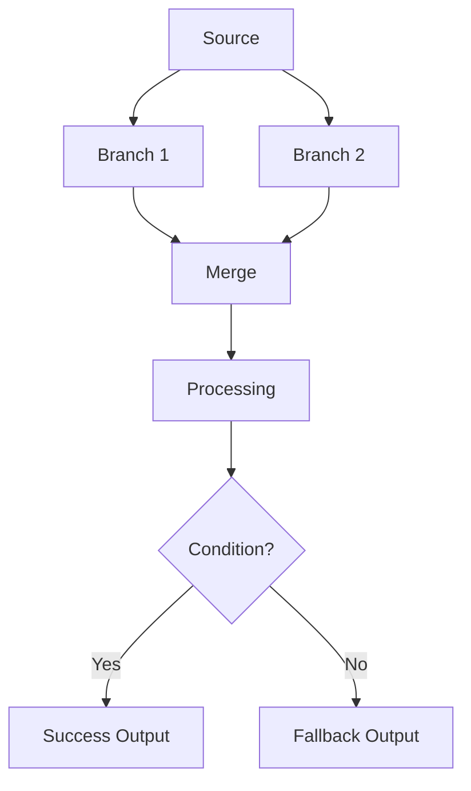
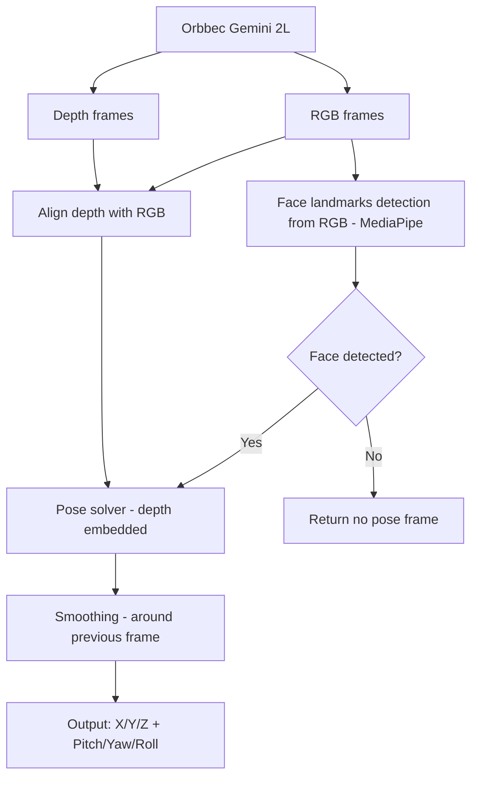

# Role
You convert pipeline requirements into clear Mermaid flowcharts that match requested wording and branching logic exactly.

# When To Use
Use this skill when the user asks for:
- a workflow diagram
- a pipeline diagram
- a process flow from text requirements

# Output Rules
- Output only Mermaid flowchart blocks unless the user asks for explanation.
- Preserve user-provided node names and wording exactly where possible.
- Keep diagrams minimal and readable.
- Use decision nodes for explicit conditions (for example: `Face detected?`).
- Use directional flow (`flowchart TD`) by default.
- **Parse-safe labels:** wrap any label that contains parentheses, slashes, colons, or line breaks in double quotes, e.g. `E["Face landmarks - MediaPipe"]`. Avoid raw ` ` inside unquoted `[...]`; use a single line or quoted `\n` instead.

# Diagram Template

# Example: Face Tracking Pipeline

