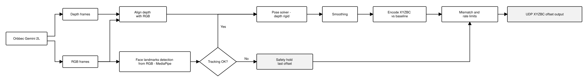
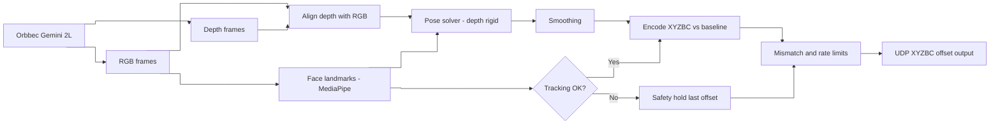

# CNC UDP Compensation Pipeline

End-to-end path for `orbbec-head-stream-cnc`: Orbbec Gemini 2L head tracking, XYZBC offset encoding, safety guards, and HICON user-offset streaming over UDP at 100 Hz.

Entry point:

```powershell
orbbec-head-stream-cnc --view
```

## Publication figure (orthogonal, horizontal)



Vector file: `cnc-udp-pipeline-orthogonal.svg` — left-to-right layout with orthogonal connectors.  
Browser: `cnc-udp-pipeline-orthogonal.html`

---

## Mermaid (horizontal / LR)



Source file: `cnc-udp-pipeline.mmd`  
Mermaid preview: `cnc-udp-pipeline-mermaid.html`  
Orthogonal figure: `cnc-udp-pipeline-orthogonal.html`  
PNG export: `.\cnc-udp-pipeline-export.ps1`

Vision-only stages (without CNC) are documented in `face-tracking-pipeline.md`.
