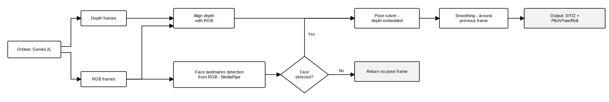
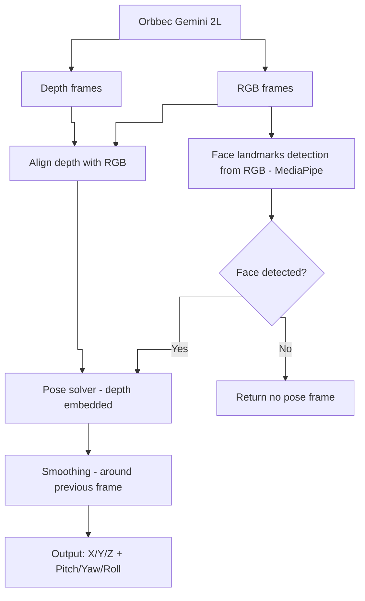

# Face Tracking Pipeline

## Publication figure (orthogonal lines)



Vector file: `face-tracking-pipeline-orthogonal.svg` (orthogonal connectors, original labels).

---

## Editable Mermaid (your labels)



Source file: `face-tracking-pipeline-ieee.mmd`  
Browser: `face-tracking-pipeline-ieee.html`

---

## LaTeX

```latex
\includegraphics[width=\linewidth]{face-tracking-pipeline-orthogonal.pdf}
```
