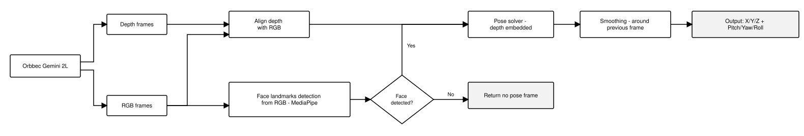
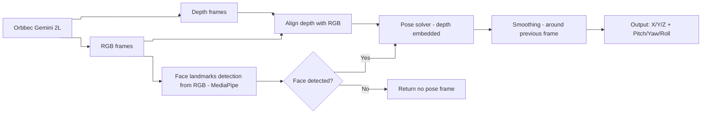

# Face Tracking Pipeline

## Publication figure (orthogonal, horizontal)



Vector file: `face-tracking-pipeline-orthogonal.svg` — left-to-right layout with orthogonal connectors.

---

## Editable Mermaid (horizontal / LR)


```mermaid
%%{init: {"flowchart": {"curve": "stepAfter"}}}%%
flowchart LR
    A["Orbbec Gemini 2L"]
    A --> B["RGB frames"]
    A --> C["Depth frames"]
    B ~~~ C
    B --> D["Align depth with RGB"]
    C --> D
    B --> E["Face landmarks detection from RGB - MediaPipe"]
    E --> F{"Face detected?"}
    F -->|Yes| G["Pose solver - depth embedded"]
    D --> G
    G --> H["Smoothing - around previous frame"]
    H --> I["Output: X/Y/Z + Pitch/Yaw/Roll"]
    F -->|No| J["Return no pose frame"]
```

Source file: `face-tracking-pipeline-ieee.mmd`  
Browser: `face-tracking-pipeline-ieee.html`

Full production path (vision + CNC UDP): [`cnc-udp-pipeline.md`](cnc-udp-pipeline.md)

---

## LaTeX

```latex
\includegraphics[width=\linewidth]{face-tracking-pipeline-orthogonal.pdf}
```
